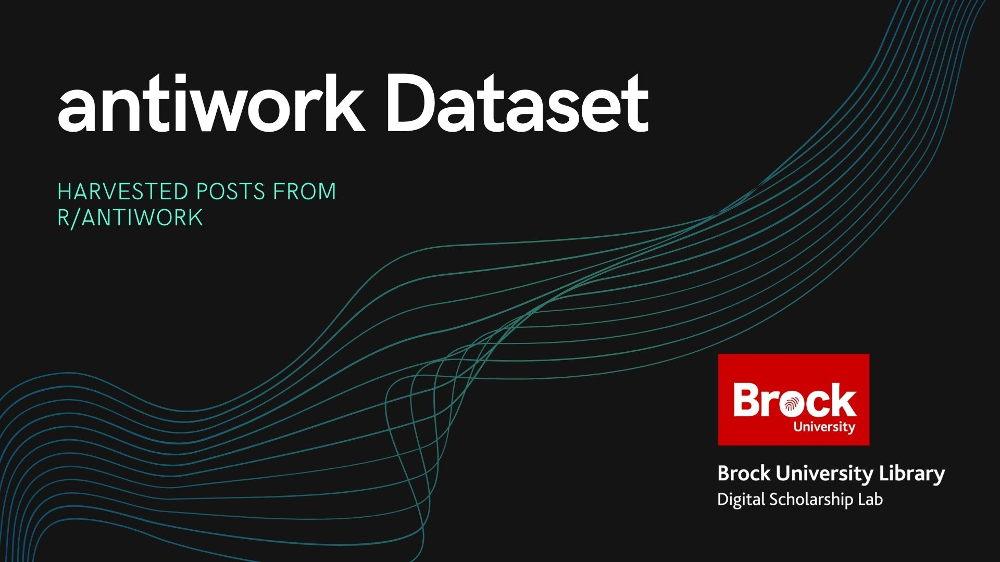

# antiwork Reddit Data Set


## Project Summary

This repository covers the code and data to generate the antiwork dataset:

- posts to r/antiwork
- from 09/01/21 - 12/31/21


## Config software

- `cp orig_settings.py settings.py`
- Fill in with your [reddit API](https://reddit.com/dev/api) particulars
- Install [https://github.com/Jabb0/SubredditDownloader](https://github.com/Jabb0/SubredditDownloader)

## Harvesting bare posts

Need to download basic metadata of posts using [PushShift API](https://github.com/pushshift/api)

- Invoke on the command line to get the 'headers' of post that match above
```
SubredditDownloader % subredditdownloader -db ../anti-work.db -r antiwork -ds pushshift --reddit-client-id FILL --reddit-client-secret FILL --reddit-username elibtronic --start-utc 1630468800 --end-utc 1641013200
```
- Use a SQLite browser to open `anti-work.db` and save as csv file `antiwork.csv`

## Enrich data with freshest API info

Uses the `post_id` of harvested heads to get full api data using [PRAW](https://praw.readthedocs.io/en/stable/) and save as [Pickle](https://wiki.python.org/moin/UsingPickle) file

- Run `Inital AP interations.ipynb` with grab PRAW objects and dump them into `raw_data` directory.


## Build Working CSV files

Work done in `Master_Builder.ipynb`. 
- Cell with `#CONFIGS` has all the values you can set for number of records etc
- Cell with `#CONFIGS #PICKLE section` are the fields from PRAW that you want in final CSV file

### Features
- Pulls __high__, __average__, __low__ level posts
- Automatically generates keywords based on frequency of terms found in the text
- Adds [VADER](https://github.com/cjhutto/vaderSentiment) scoring to records


## Example data generated

[Header data set](https://github.com/BrockDSL/antiwork_reddit_data_set/blob/main/antiwork.csv)

[Example PRAW item fetched](https://gist.github.com/elibtronic/030706222ce9240c3bc5bd959f5af64f)

[Sample of 1000 records as CSV](https://github.com/BrockDSL/antiwork_reddit_data_set/blob/main/antiwork_sample.csv?raw=true) 
